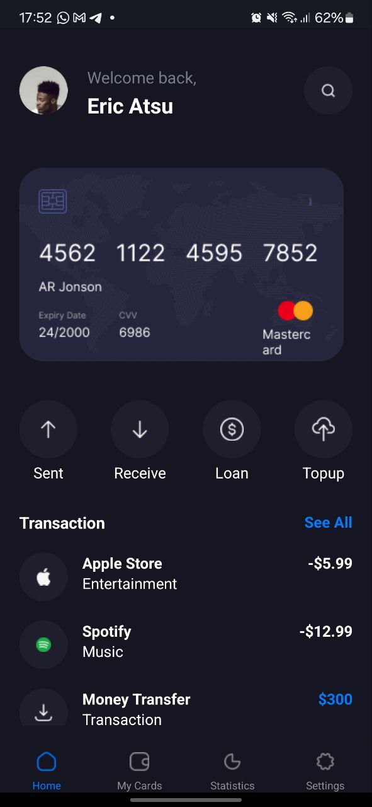

## React Native Themed App
This React Native application demonstrates the implementation of a light and dark theme using React Context API. The app features multiple screens including Home, Cards, Statistics, and Settings, with a bottom tab navigator for easy navigation.

## Features
*Light and dark mode support*
The switch was used to toggle between the dark and light theme. The onChange was used to handle the touches to the switch

*Context API for managing theme state*
ThemeContext to handle the changes in themes

*React Navigation for handling screen navigation*
The bottomtab navigation was used for navagation in this project

*Custom components for reusable UI elements*
Custom components like actions, card, header and drawbar were created and imported for usage in the screen

## Screenshots
## Light Mode

## Dark Mode

## How It Was Built
Project Structure
The project is structured into the following directories:

/assets: Contains image assets used in the app.
/components: Contains custom reusable components.
/screens: Contains individual screen components.
ThemeContext.js: Context for managing theme state.
Navigator.js: Main navigation configuration.
App.js: Root component that initializes the theme provider and navigation.